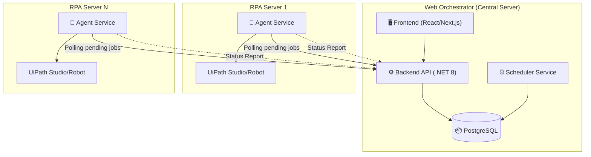
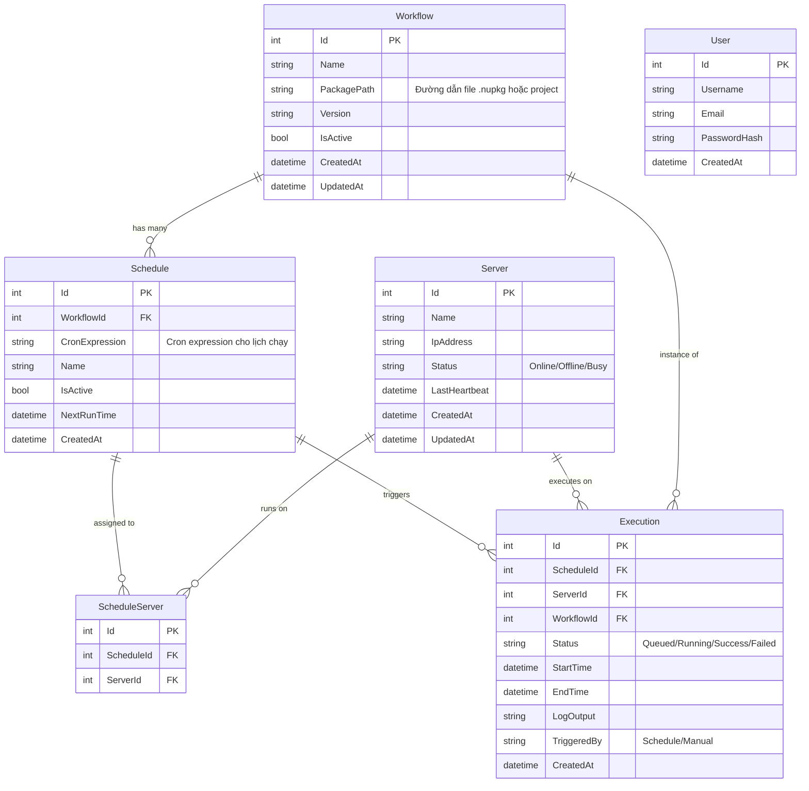
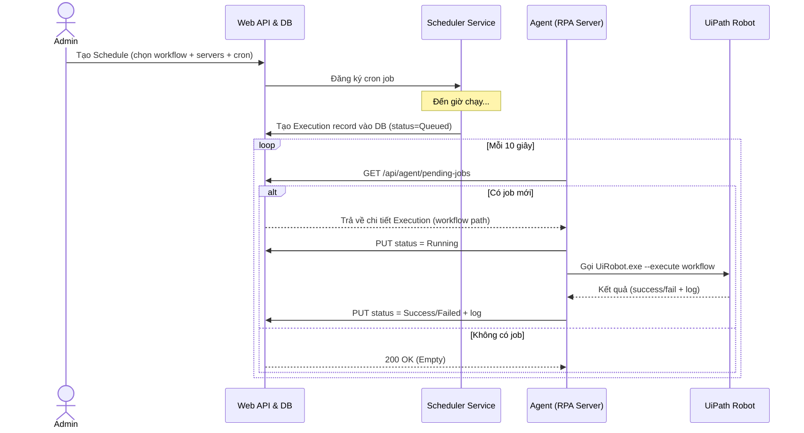
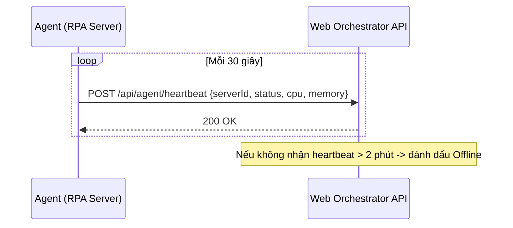
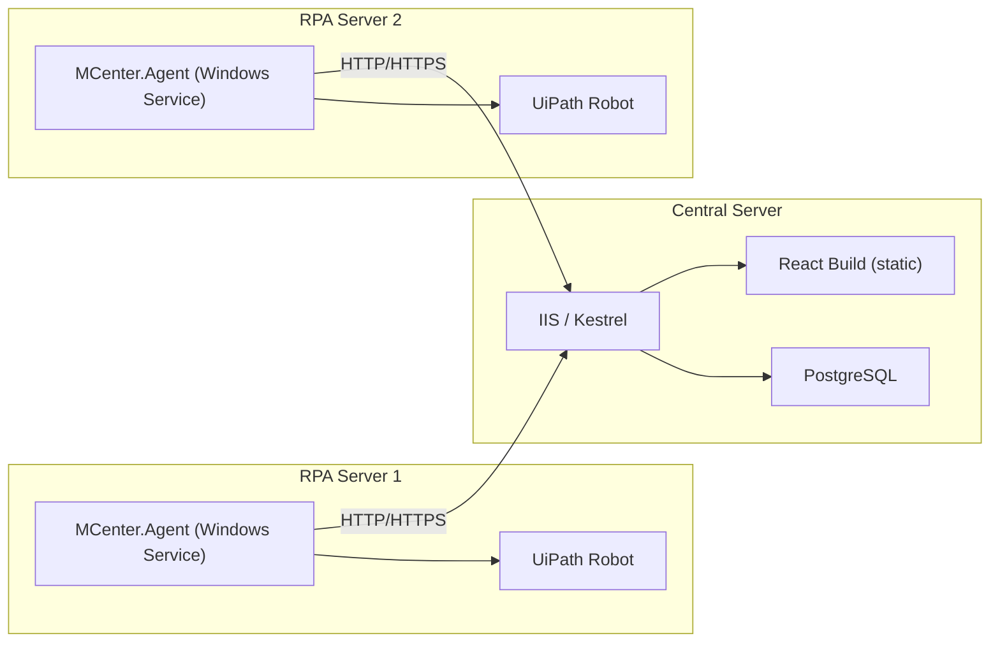

# 🏗️ Thiết kế Kiến trúc Hệ thống RPA Orchestrator

## 1. Tổng quan bài toán

Xây dựng hệ thống quản trị và đặt lịch chạy cho các workflow RPA (UiPath), bao gồm:

- **Web Orchestrator**: Quản lý server, quản lý workflow, đặt lịch chạy
- **Agent trên các Server**: Nhận lệnh từ Orchestrator, thực thi workflow UiPath trên máy local

---

## 2. Kiến trúc hệ thống tổng quan



---

## 3. Kiến trúc chi tiết

### 3.1. Web Orchestrator (Central Server)

| Thành phần | Mô tả |
|---|---|
| **Frontend** | Dashboard quản lý server, workflow, lịch chạy, log kết quả |
| **Backend API** | RESTful API xử lý CRUD, authentication, authorization |
| **Scheduler Service** | Quản lý cron jobs, trigger workflow theo lịch đã đặt, đưa lệnh vào Database chờ Agent lấy |
| **Database** | Lưu thông tin server, workflow, lịch chạy, lịch sử thực thi |

### 3.2. Agent Service (trên mỗi RPA Server)

| Thành phần | Mô tả |
|---|---|
| **Agent Daemon** | Service chạy nền, liên tục gọi API về Web Orchestrator để lấy lệnh thực thi (Polling) |
| **UiPath CLI Wrapper** | Gọi `UiRobot.exe` để thực thi workflow |
| **Status Reporter** | Gửi trạng thái thực thi (đang chạy, thành công, lỗi) về Orchestrator |
| **Health Check** | Heartbeat để Orchestrator biết server còn hoạt động |

---

## 4. Lựa chọn công nghệ

### Phương án: **.NET 8 + React**

| Layer | Công nghệ | Lý do |
|---|---|---|
| **Frontend** | React + TypeScript + Ant Design | UI phong phú, component library mạnh cho dashboard |
| **Backend API** | .NET 8 (ASP.NET Core Web API) | Hiệu suất cao, hệ sinh thái .NET tương thích tốt với UiPath (cũng là .NET), strongly-typed |
| **Scheduler** | Hangfire hoặc Quartz.NET | Tích hợp sẵn với .NET, hỗ trợ cron expression, dashboard giám sát |
| **Database** | PostgreSQL | Mã nguồn mở, hiệu suất cao, tương thích tốt với Entity Framework Core qua Npgsql |
| **Agent Service** | .NET Worker Service | Chạy như Windows Service, gọi UiPath CLI, định kỳ polling lấy job từ API |
| **Real-time** | SignalR | Push notification trạng thái thực thi real-time về dashboard |
| **Auth** | JWT + ASP.NET Identity | Xác thực và phân quyền |

> [!NOTE]
> Phương án .NET được ưu tiên vì UiPath chạy trên nền .NET, việc tích hợp và gọi UiPath API/CLI từ .NET sẽ mượt mà hơn. Chúng ta sử dụng cơ chế **Polling qua HTTP** giữa Agent và Orchestrator để đơn giản hóa kiến trúc, giúp việc triển khai dễ dàng mà không cần cài đặt thêm Message Queue bên thứ 3.

---

## 5. Thiết kế Database (ERD)



---

## 6. Luồng hoạt động chính

### 6.1. Đặt lịch và thực thi workflow (Cơ chế Polling)



### 6.2. Heartbeat & Server Monitoring



---

## 7. Cấu trúc thư mục dự án

```
MCenter/
├── src/
│   ├── MCenter.API/                    # ASP.NET Core Web API
│   │   ├── Controllers/
│   │   │   ├── ServersController.cs
│   │   │   ├── WorkflowsController.cs
│   │   │   ├── SchedulesController.cs
│   │   │   ├── ExecutionsController.cs
│   │   │   └── AgentController.cs      # API cho Agent polling & heartbeat
│   │   ├── Services/
│   │   │   ├── SchedulerService.cs
│   │   │   └── ExecutionService.cs
│   │   ├── Hubs/
│   │   │   └── ExecutionHub.cs         # SignalR Hub (Optional cho dashboard realtime)
│   │   └── Program.cs
│   │
│   ├── MCenter.Core/                   # Domain models, DbContext
│   │
│   ├── MCenter.Agent/                  # Windows Service trên RPA Server
│   │   ├── Services/
│   │   │   ├── PollingWorker.cs        # Vòng lặp lấy jobs
│   │   │   ├── UiPathExecutor.cs       # Chạy UiRobot.exe
│   │   │   └── HeartbeatWorker.cs      # Gửi status định kỳ
│   │   ├── appsettings.json
│   │   └── Program.cs
│   │
│   └── mcenter-web/                    # React Frontend
│       ├── src/
│       │   ├── pages/
│       │   │   ├── Dashboard.tsx
│       │   │   ├── Servers.tsx
│       │   │   └── Workflows.tsx
│       │   └── App.tsx
│       └── package.json
```

---

## 8. API Endpoints chính cho Agent

### Dành cho giao tiếp Agent ↔ Orchestrator

| Method | Endpoint | Mô tả |
|---|---|---|
| `GET` | `/api/agent/pending-jobs` | (Polling) Lấy danh sách record execution có status=Queued |
| `POST` | `/api/agent/heartbeat` | Agent báo cáo server vẫn sống và gửi tài nguyên máy (CPU/RAM) |
| `PUT` | `/api/agent/executions/{id}/status` | Agent cập nhật trạng thái job (Running ➝ Success/Failed) |

---

## 9. Cách Agent gọi UiPath

Agent sẽ sử dụng **UiPath CLI** (`UiRobot.exe`) để thực thi workflow:

```csharp
// UiPathExecutor.cs
public class UiPathExecutor
{
    private readonly string _uiRobotPath = 
        @"C:\Program Files\UiPath\Studio\UiRobot.exe";

    public async Task<ExecutionResult> ExecuteAsync(
        string projectPath, CancellationToken ct)
    {
        var process = new Process
        {
            StartInfo = new ProcessStartInfo
            {
                FileName = _uiRobotPath,
                Arguments = $"execute --file \"{projectPath}\" --reportType json",
                RedirectStandardOutput = true,
                RedirectStandardError = true,
                UseShellExecute = false,
                CreateNoWindow = true
            }
        };

        process.Start();
        
        var output = await process.StandardOutput.ReadToEndAsync(ct);
        var error = await process.StandardError.ReadToEndAsync(ct);
        
        await process.WaitForExitAsync(ct);

        return new ExecutionResult
        {
            ExitCode = process.ExitCode,
            Output = output,
            Error = error,
            Success = process.ExitCode == 0
        };
    }
}
```

---

## 10. Giao tiếp Orchestrator ↔ Agent theo cơ chế Polling

- Agent là client chủ động thực hiện HTTP Requests tới Web API.
- Tần suất (Polling interval): Có thể cấu hình được trong `appsettings.json` (VD: 5 giây, 10 giây).
- **Ưu điểm**:
  - Không cần cài đặt phần mềm Messaging Queue bổ sung (như RabbitMQ / Redis / Kafka).
  - Kiến trúc vô cùng đơn giản, dễ debug thông qua HTTP logs thông thường.
  - Phù hợp với số lượng Server Agent ở mức trung bình (vd: < 100 bots).
- **Nhược điểm (Đã chấp nhận tradeoff)**:
  - Job không được kích hoạt ngay lập tức mà bị delay tối đa bằng khoảng thời gian Polling (Ví dụ: delay < 10s).
  - Tốn thêm tài nguyên gọi mạng do các request trống (200 OK nhưng không có Job), tuy nhiên tài nguyên này không đáng kể ở quy mô doanh nghiệp thông thường.

---

## 11. Deployment



### Cách triển khai Agent:
1. Build ứng dụng `MCenter.Agent` thành Worker/Windows Service.
2. Copy ra các RPA Server cần thiết.
3. Thay thế cấu hình trong `appsettings.json` (Đặt đường dẫn API Url trỏ tới Central Server).
4. Cài đặt và start service thông qua SC Command.

---

## 12. Tóm tắt công nghệ

| Thành phần | Công nghệ |
|---|---|
| Backend API | **.NET 8** (ASP.NET Core Web API) |
| Frontend | **React** + TypeScript + Ant Design |
| Database | **PostgreSQL** |
| ORM | **Entity Framework Core** |
| Scheduler | **Hangfire** |
| Giao tiếp Agent | **HTTP Polling** |
| Agent | **.NET Worker Service** (Windows Service) |
| Auth | **JWT** + ASP.NET Identity |
| UiPath Integration | **UiRobot.exe CLI** |
